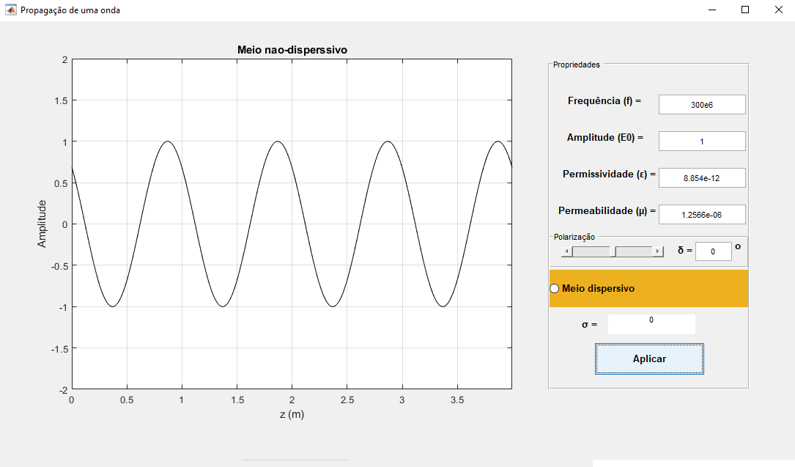
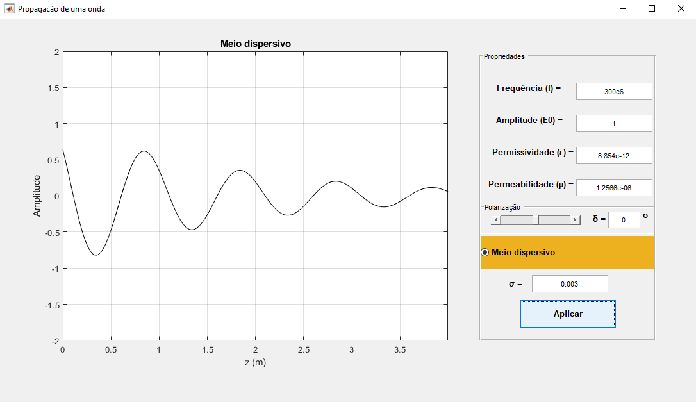
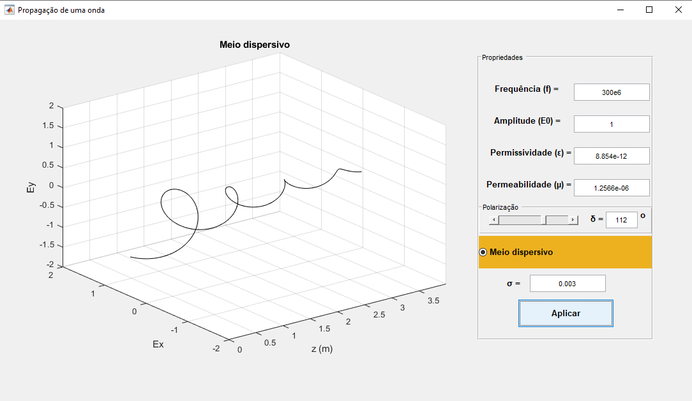

# Propaga-o-de-Ondas
App desenvolvido em MATLAB para a visualização didática, em forma de animação, da propagação de uma onda eletromagnética, polarizada ou não, em meios dispersivos/não dispersivos.

